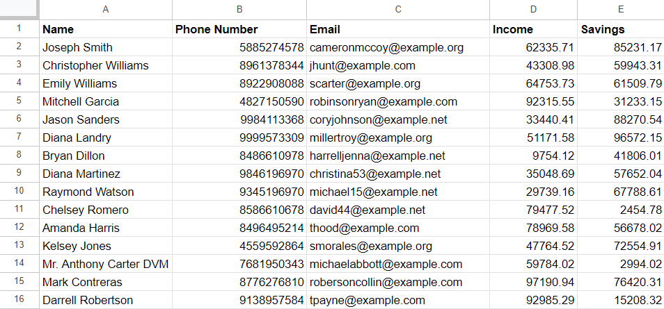
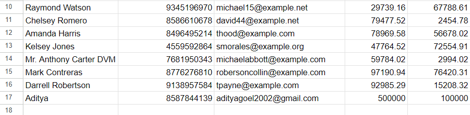

# DataPulse - Data Collection Platform with SMS Notification Feature

Created by [Jayesh Muley](https://github.com/jayesh3103)
This repository contains the code for a data collection platform that also has an SMS notification feature.

## Tools and Technologies Used :computer:
- Python (Django)
- AWS (S3, SQS, Lambda)
- Postman
- Twilio (SMS Feature)
- Docker
- GitHub

## Consistency and Scalability :rocket:
```Eventual consistency is what the clients expect as an outcome of this feature, making sure no responses get missed in the journey. Do keep in mind that this solution must be failsafe, should eventually recover from circumstances like power/internet/service outages, and should scale to cases like millions of responses across hundreds of forms for an organization```

My first approach to handle Scalability at Millions of requests, was to use AWS Lambda (Serverless) as an event based architecture to give response.
This approach is great in itself because it provides continuous scaling for a huge number of requests. `However it can be further optimised as below.`

### 2nd Approach
Amazon Simple Queue Service (SQS) is a fully managed message queuing service that enables us to decouple and scale microservices, distributed systems, and serverless applications.

In this approach, SQS can act as a buffer and rate limiter for our Lambda function. Instead of directly triggering the Lambda function upon S3 upload, I can send a message to SQS. Then, the Lambda function can be triggered by SQS to process the file. This can help to prevent the Lambda function from getting overwhelmed with too many requests at once, especially when there is huge records in the file or many files are uploaded to S3 at the same time.
SQS is a great tool to control the number of responses or data sent to AWS Lambda function. AWS Simple Queue Service (SQS) supports batch operations, which can be used to control the data or message being sent to AWS Lambda functions.

In addition to the AWS service used, I have used Django which is a popular web framework for building scalable and maintainable web applications.
There are several methods which can be implemented to handle hige amount of requests to the server like:
- <b>Using database partitioning-</b>
Database partitioning is a technique used to split a large database table into smaller, more manageable pieces. By partitioning a table, we can distribute the load across multiple servers and improve the performance of our application.
- <b>Caching-</b> `Beneficial when there are many get requests or fetching queries`
Caching is another technique that we can use to improve the performance of our Django application. By caching frequently accessed data, we can reduce the load on the database and improve the response time of our application.
- <b>Indexing-</b> `Beneficial when there are many get requests or fetching queries`
Indexing is a database technique used to improve the performance of queries by creating an index on one or more columns in a table. An index allows the database to quickly locate and retrieve the data that matches a query.
- <b>Database Sharding-</b>
Database sharding is a technique used to horizontally partition a database across multiple servers. By sharding a database, we can distribute the load across multiple servers and improve the performance of our application.
To use database sharding in Django, we can use the `ShardedRouter` from the `django-sharding` library, which provides a convenient way to shard a database table. 


### Task - 1 ✅
```One of the clients wanted to search for slangs (in local language) for an answer to a text question on the basis of cities (which was the answer to a different MCQ question)```

#### Forms Model
```
class Forms(models.Model):
    title = models.CharField(max_length=255)
    description = models.TextField()
    email = models.CharField(max_length=255, blank=True)
    created_at = models.DateTimeField(auto_now_add=True)
    updated_at = models.DateTimeField(auto_now=True)
    metadata = JSONField()
```

#### Questions Model
```
class Questions(models.Model):
    QUESTION_TYPES  = [
        ('text', 'Text'),
        ('mcq', 'Multiple Choice'),
    ]

    form = models.ForeignKey(Forms, on_delete=models.CASCADE, related_name="questions")
    question_text = models.CharField(max_length=255)
    question_type = models.CharField(max_length=100, choices=QUESTION_TYPES, default='text')
    created_at = models.DateTimeField(auto_now_add=True)
    updated_at = models.DateTimeField(auto_now=True)
```

#### Choice Model
```
class Choice(models.Model):
    choice_id = models.AutoField(primary_key=True)
    question = models.ForeignKey(Questions, related_name='choices', on_delete=models.CASCADE)
    choice_text = models.CharField(max_length=200)
```

#### Responses Model
```
class Responses(models.Model):
    form = models.ForeignKey(Forms, on_delete=models.CASCADE, related_name="responses")
    submitted_at = models.DateTimeField(auto_now_add=True)
    metadata = JSONField()
```

#### Answers Model
```
class Answers(models.Model):
    response = models.ForeignKey(Responses, on_delete=models.CASCADE, related_name="answers")
    question = models.ForeignKey(Questions, on_delete=models.CASCADE)
    answer_text  = models.TextField()
    selected_choice = models.ForeignKey(Choice, on_delete=models.CASCADE, null=True, blank=True)
    submitted_at = models.DateTimeField(auto_now_add=True)
    metadata = JSONField()
```

### Schema Design
The schema provided here supports data collection using forms, and manages form definitions, questions, responses, and answers.

### Model Descriptions
#### Forms Model
The Forms model defines a form to be filled out. Each form has a title, description, email, created_at, updated_at and metadata fields. The metadata field is a JSONField that can be used to store any additional, form-specific information in JSON format.

#### Questions Model
The Questions model defines the individual questions within a form. Each question is associated with a form through a foreign key relationship to the Forms model. A question has a question_text, question_type, and metadata. The question_type can be either 'Text' or 'Multiple Choice', and the metadata field is a JSONField that can store any additional question-specific information in JSON format.

#### Choice Model
The Choice model defines the choices for multiple choice questions. Each choice is associated with a Questions model through a foreign key relationship. Each choice has a choice_text which is the text of the choice.

#### Responses Model
The Responses model captures the responses to a form. Each response is associated with a form through a foreign key relationship to the Forms model. Each response has a submitted_at timestamp and a metadata field that can store any additional response-specific information in JSON format.

#### Answers Model
The Answers model captures the individual answers within a response. Each answer is associated with a Responses model and a Questions model through foreign key relationships. If the question is a text question, the answer is stored in answer_text. If the question is a multiple choice question, the selected choice is stored in selected_choice, which is a foreign key field pointing to the Choice model. Each answer also has a submitted_at timestamp and a metadata field that can store any additional answer-specific information in JSON format.

### Usage
This schema design enables handling forms, their questions (both text and multiple choice), and the responses and individual answers to those forms. It supports flexible data collection, and the JSONField in each model allows for storing additional information specific to forms, questions, responses, and answers.

We can use google translate API for translation purposed into the local language.

### Task - 2 ✅
```A market research agency wanted to validate responses coming in against a set of business rules (eg. monthly savings cannot be more than monthly income) and send the response back to the data collector to fix it when the rules generate a flag.```

#### Client Schema
```
class Clients(models.Model):
    client_email = models.CharField(max_length=255)
    client_name = models.CharField(max_length=255)
    income_per_annum = models.FloatField()
    savings_per_annum = models.FloatField()
    mobile_number = models.CharField(max_length=15)
 ```

Sending response via Postman


### AWS Architecture


SQS acts as a buffer and rate limiter for our Lambda function. Instead of directly triggering the Lambda function upon S3 upload, whenever a file is uploaded to S3, a message will be sent to SQS. Then, the Lambda function can be triggered by SQS to process the file. This can help to prevent the Lambda function from getting overwhelmed with too many requests at once, especially when there is huge records in the file or many files are uploaded to S3 at the same time.

### Lambda function


```python
import boto3
import json
from decouple import config
from twilio.rest import Client
import csv

def send_sms(data):
    account_sid = config('TWILIO_ACCOUNT_SID')
    auth_token = config('TWILIO_AUTH_TOKEN')
    twilio_number = config('TWILIO_NUMBER')
    client = Client(account_sid, auth_token)

    try:
        response = "Sending SMS"
        message = client.messages.create(body=f"{data}'s savings is greater than income", from_ = twilio_number, to='+918887874339')
        print(message.sid)
        response = message.sid
    except Exception as e:
        print(f"An error occurred while sending the SMS: {str(e)}")
        response = e


def lambda_handler(event, context):
    key = 'data.csv'
    bucket = 'atlan-data-collection'
    s3 = boto3.client('s3')

    s3_resource = boto3.resource('s3')
    s3_object = s3_resource.Object(bucket, key)
    
    data = s3_object.get()['Body'].read().decode('utf-8').splitlines()
    
    lines = csv.reader(data)
    headers = next(lines)
    for line in lines:
        if(line[4] > line[3]):
            # print(line[0], line[4], line[3])
            send_sms(line[0])

    return {
        'statusCode': 200,
        'body': json.dumps('Done!')
    }
```

I have added `TWILIO_ACCOUNT_SID`, `TWILIO_AUTH_TOKEN` and `TWILIO_NUMBER` as environment variables for the lambda function for security and privacy purposed which is a good practice.

I have also used Lambda layer for `python-decouple` and `twilio` library.
Lambda Layers are a useful feature in AWS Lambda that allows us  to include external dependencies, such as Python libraries, with our Lambda function without increasing the size of your function deployment package. This is particularly helpful when the Lambda function requires third-party libraries that are not available in the Lambda runtime environment. These 2 libraries are not available in the Lambda runtime environment, hence I have used Lambda layers.

### Final response send to the specified number.


I have included above, some of the messages received. I have sent client'name in this case, we can simply send any other field like client ID or multiple details also using the same method.


### Task - 3 ✅
```A very common need for organizations is wanting all their data onto Google Sheets, wherein they could connect their CRM, and also generate graphs and charts offered by Sheets out of the box. In such cases, each response to the form becomes a row in the sheet, and questions in the form become columns.```

### Data in the sheet


### How it Works
- Setting up the Google Sheets API: The script uses the Google Sheets API to interact with Google Sheets. The necessary libraries are imported, and the required access scope is defined (https://www.googleapis.com/auth/spreadsheets).

- Google Sheets ID and Range: I have specified the target Google Sheet where the form responses will be stored. The Google Sheets ID is a unique identifier that can be found in the URL of the Google Sheet. The script also specifies the sheet and range (RANGE) where the data will be appended.

- Function push_to_google_sheet(data): This function is responsible for pushing form responses to the Google Sheet. It takes a dictionary (data) containing form responses as input. The script then arranges the form responses in the required order and appends them as a new row in the specified Google Sheet.

- Function authorise(): This function handles the authentication and authorization process for the Google Sheets API. It checks for existing credentials in the token.json file. If no valid credentials are found or they have expired, it initiates the login flow to grant permission to access the Google Sheets. Once authorized, the credentials are saved to the token.json file for future use. The function then builds the Google Sheets API service object, which is used to interact with Google Sheets.


### Task - 4 ✅
```A recent client partner wanted us to send an SMS to the customer whose details are collected in the response as soon as the ingestion was complete reliably. The content of the SMS consists of details of the customer, which were a part of the answers in the response. This customer was supposed to use this as a “receipt” for them having participated in the exercise.```

## Sending response via API endpoint from Postman

It will also check beforehand if the client already exists or not. If it does, then it says `Client already exists`, else a new client data is created.

## Message received after submitting the response via Twilio


I have used Twilio, a cloud communications platform, for the SMS feature. Twilio's APIs enable us to send SMS messages globally and reliably.
This is one of the unique features - the ability to send an SMS to the customer whose details are collected in the response as soon as the ingestion is complete reliably. The content of the SMS consists of details of the customer, which were a part of the answers in the response. This allows the customer to use the SMS as a “receipt” for their participation in the exercise.

Whenever the user sends their response, the data is pushed to google sheets and a text message is also sent to the user with their details/response.



## Dockerizing Django Application:
I have Dockerized the Django application, allowing for easy and consistent deployment across various environments. By creating a Dockerfile and defining the necessary configurations, this approach packages the Django application and its dependencies into a portable container. Dockerization streamlines the setup process, promotes code portability, and ensures that the application runs consistently on any system with Docker installed. It simplifies development, testing, and deployment, making it an ideal solution for building scalable and maintainable Django applications.

After builing the image, we can simply run the following command to start the application-
`docker run -d -p 8000:8000 <image-name>`

## Thanks for this opportunity and the exciting assignment!
